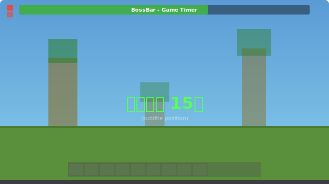

# LadderCountdown

**バージョン: v1.4.0**

> ⚠️ v1.4.0 で **s2e-ladder 専用に戻しました**（v1.3.0 の汎用化＝対象自動検出は撤回）。Farm のカウントダウンは別プラグイン **FarmCountdown** が担当します。

streamtoearn 系ゲームプラグイン（s2e-ladder）の**ゲーム開始カウントダウン秒数**を、サーバーを止めずにコマンドで変更するための補助プラグインです。TikTok 妨害配信で、配信を中断せずカウントダウンを調整する目的で作成しています。

> v1.3.0 で**対象プラグインを自動検出**するようになりました。`config.yml` の `targets` に「導入済み」のプラグインがあれば、それを自動で対象にします（s2e-ladder 専用ではなくなりました）。

### イメージ

カウントダウン変更時、サブタイトル位置に秒数を表示します。



---

## 対応状況（重要）

| プラグイン | カウントダウン変更 | 方式 |
|---|---|---|
| **s2e-ladder** | ✅ 可能 | `timer.yml` 書き換え＋実行中インスタンスへリフレクション即時反映 |
| **s2e-farm-pro** | ❌ 不可 | 秒数(既定10秒)が**プラグイン内にハードコード**。設定ファイル・コマンドのどこにも秒数が無く、jar も難読化されているため外部から変更できません |
| s2e-survival | 未検証 | （`supported: false`。方式が判明したら config で有効化） |

> s2e-farm-pro について: jar を解析した結果、`TimerSettings`(record) に countdown 項目が存在せず、内部の `CountdownTimer` も config を一切読み込まない（`getInt` 不使用）ことを確認しました。カウントダウン値は毎ゲーム生成され、初期値 10 秒はコード定数です。よって**ファイル書き換えでもリフレクションでも恒久的な変更はできません**。変更したい場合は streamtoearn.io へ「カウントダウン秒数の設定対応」を要望するのが確実です。

---

## 概要・仕組み（対応プラグイン）

s2e-ladder はカウントダウン秒数を **プラグイン起動時に一度だけ** `timer.yml` から読み込みます。そのためファイルを書き換えるだけでは再起動まで反映されません。本プラグインは次の2段構えで反映します。

1. **ファイル永続化**: 対象プラグインの `timer.yml` の `settings.timer.countdown`（`config-path`）を書き換え。
2. **実行中インスタンスへ即時反映**（`reflect: ladder` のとき）: リフレクションで `TimerManager` を辿り、
   - キャッシュ済みの `TimerSettings`(record) を新しい秒数で差し替え、
   - **カウントダウン動作中なら内部 Runnable の `time` フィールドを直接書き換え**て画面の数値を即変更（辿れない場合は `start()` で再カウント）。

カウントダウン変更時は、全プレイヤーにタイトル「タイマー N秒」＋効果音を表示します（10秒超＝赤＋低音 / 10秒以下＝緑＋高音）。

---

## コマンド

| コマンド | 説明 |
|---|---|
| `/laddercount` | 対象プラグイン・現在の countdown 値・自動リセット状態を表示 |
| `/laddercount <秒>` | カウントダウン秒数を変更（1〜3600）。対応プラグインなら即反映 |
| `/laddercount autoreset on` | **起動時 自動リセット**を ON（再起動で `default-countdown` 秒へ戻す） |
| `/laddercount autoreset off` | 自動リセットを OFF（変更値を再起動後も保持） |
| `/laddercount autoreset status` | 自動リセットの現在状態を表示 |
| `/laddercount reload` | `config.yml` を再読み込み |

- 権限: `laddercountdown.set`（デフォルト op）
- タブ補完対応（`autoreset` / `reload` / `on` `off` `status` / 秒数例）
- 変更不可（`supported: false`）のプラグインが対象のときは、理由を表示して何もしません（誤反映防止）。

---

## 対象プラグインの自動検出（config.yml）

`targets` を上から見て「サーバーに導入済み」の最初の1件を対象にします。

```yaml
reset-on-start: false      # 起動時に default-countdown へ自動リセットするか
default-countdown: 15      # 自動リセット時/デフォルト秒数

targets:
  - plugin: s2e-ladder           # 対象プラグイン名（plugin.yml の name）
    timer-file: timer.yml        # 秒数を書き込むファイル
    config-path: settings.timer.countdown  # 秒数の YAML パス
    reflect: ladder              # ladder=即時反映 / none=ファイルのみ
    supported: true
  - plugin: s2e-farm-pro
    timer-file: timer.yml
    config-path: settings.timer.countdown
    reflect: none
    supported: false             # 変更不可（理由を note に）
    note: "s2e-farm-pro はカウントダウン(既定10秒)がハードコードのため、外部から変更できません。"
```

新しい s2e 系プラグインが「`timer.yml` などにカウントダウンを持つ」と分かれば、`targets` に追記＋`/laddercount reload` で対応できます（再ビルド不要）。

---

## 起動時 自動リセット

配信中に `/laddercount 30` などで変えた秒数を、サーバー再起動のたびに **`default-countdown`（既定15秒）へ自動で戻す**機能です。

- `config.yml` の `reset-on-start`（初期 **false**）で制御。`/laddercount autoreset on|off` で切り替えると永続化されます。
- ON のとき、`onEnable` で対象プラグインの `timer.yml` を `default-countdown` へ上書きします（`supported: true` のプラグインのみ）。
- `plugin.yml` で `loadbefore: [s2e-ladder, s2e-farm-pro, s2e-survival]` を指定しているため、**対象プラグインが読み込む前に**書き換わり、起動直後からその秒数で開始します。

---

## インストール / 反映

1. ビルドした `LadderCountdown_v1.3.0.jar` を `plugins/` に配置。
2. サーバー再起動（または `/reload confirm`）で有効化。`config.yml` / `README.md` は初回起動時に自動生成。

ビルドは [minecraft-build-env] のオフライン手順（JDK21 + paper-api、Maven不使用）。

---

## 注意点

- `reflect: ladder` は s2e-ladder のクラス/フィールド名（`ListenersManager` / `TimerManager` / `settings` / `countdown` / `countdownTask` / `TimerManager$1.time`）に依存しています。**s2e-ladder のバージョンアップでこれらの名前が変わるとリフレクションが壊れる**ため、その場合は本プラグインの更新が必要です。
- 難読化されたプラグイン（s2e-farm-pro 等）はクラス名指定リフレクションが使えないため、`reflect: ladder` は機能しません。

---

## 更新履歴

| バージョン | 変更点 |
|---|---|
| v1.4.0 | **s2e-ladder 専用に戻した**（v1.3.0 の汎用化＝targets 自動検出を撤回）。Farm は別プラグイン FarmCountdown が担当。 |
| v1.3.0 | **対象プラグインを自動検出**（`config.yml` の `targets`）。プラグイン名・ファイル・キー・反映方式・対応可否を設定化。誤った「s2e-ladder」固定表示を解消。`default-countdown` を設定可能に。`/laddercount reload` 追加。`loadbefore` に farm/survival を追加。s2e-farm-pro はハードコードのため変更不可と明記。 |
| v1.2.0 | 起動時 自動リセット機能（`reset-on-start` / `/laddercount autoreset`）追加。`softdepend` → `loadbefore: [s2e-ladder]` に変更。タブ補完追加。 |
| v1.1.0 | barrier/gacha を独立プラグインへ分離。countdown 単機能化。 |

---

> 📌 **メンテナンス方針**: 機能を変更してバージョンを上げたときは、必ず本 README の「バージョン」表記・コマンド表・更新履歴も合わせて更新すること。
